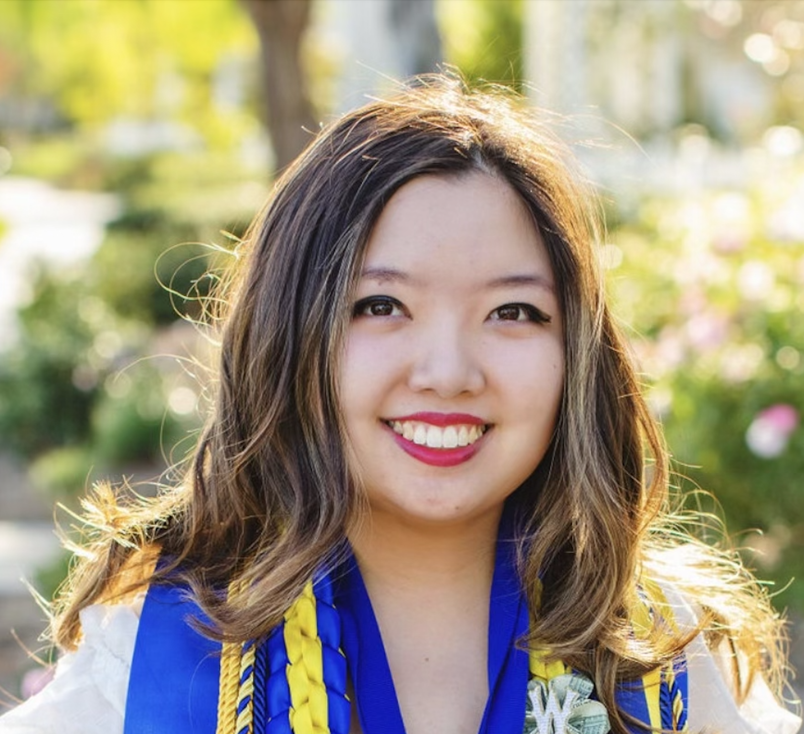

# Charlotte Kim's Portfolio

## About
Hi! My name is Charlotte Kim. I am a fourth year Computer Science and Engineering major and Entreprenurship and Innovation minor at UC San Diego's Jacobs School of Engineering. I am a hard-worker, self-starter, and life-long learner. I have been coding since elementary school when I did LEGO robotics. I transitioned to Java, Python, and C++ in middle school and high school. I also dabbled in HTML, CSS, and JavaScript. I was the president of my high school's coding olympiad and obtained a Microsoft certification. I also have experience in cybersecurity, using Linux and Oracle for two years in my cybersecurity classes. I was also a team lead for my software engineering course at UCSD. 

### Languages I Am Comfortable With  
- Java
* Python
+ C++

## Projects
